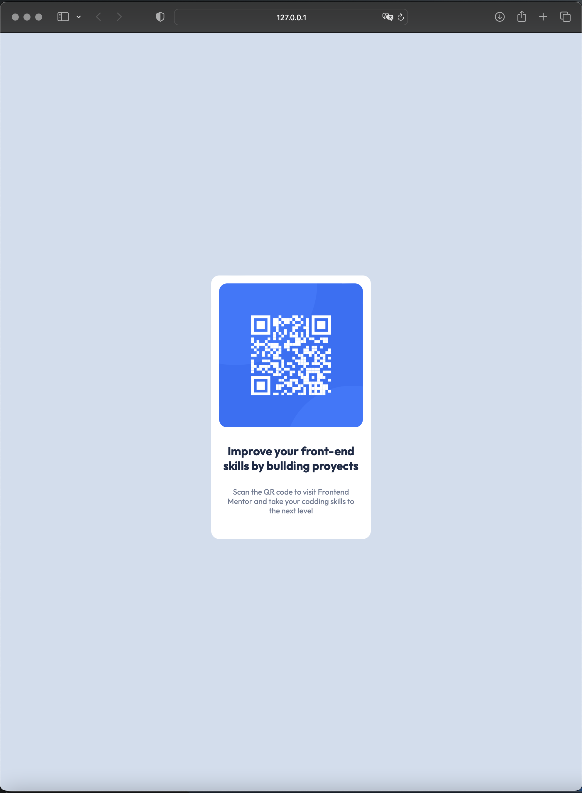
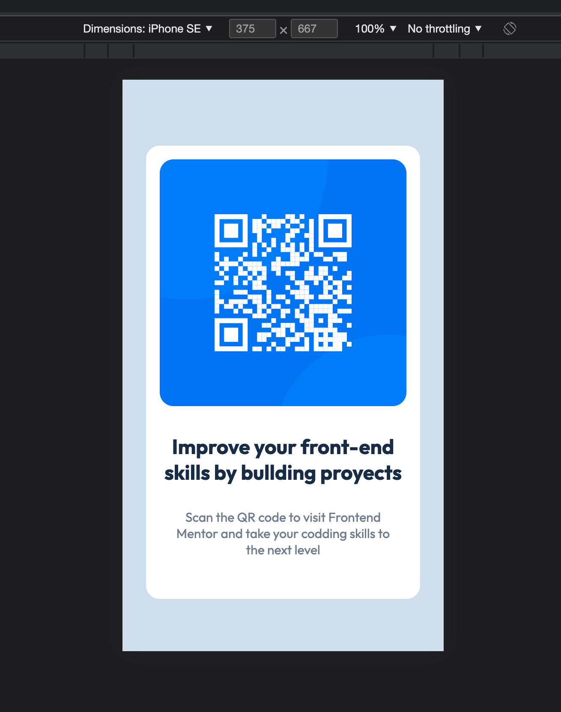

# Frontend Mentor - QR code component solution

This is a solution to the [QR code component challenge on Frontend Mentor](https://www.frontendmentor.io/challenges/qr-code-component-iux_sIO_H). Frontend Mentor challenges help you improve your coding skills by building realistic projects.

## Table of contents

- [Overview](#overview)
  - [Screenshot](#screenshot)
  - [Links](#links)
- [My process](#my-process)
  - [Built with](#built-with)
  - [What I learned](#what-i-learned)
- [Author](#author)

## Overview

A simple card, and a QR code with a link to the Front Mentor program webopage.
It's programed with Html and CSS and pretend to be responsive.

## Screenshot




### Built with

- Semantic HTML5 markup
- CSS custom properties
- Flexbox
- Mobile-first workflow

### What I learned

I was stuck for an hour because the card dosen't center in the page, so a inveestiged a little and discover the solution with the `min-heigth` property, it's save the day.
The whole project takes me about 2 hours (half the time I was looking for a _flexbox_ solution).

```
body {
    padding:0;
    background-color:   hsl(212, 45%, 89%);
    font-family: 'Outfit', sans-serif;
    min-height: 100vh; /* <- REMEMBER THIS!! */
    display: flex;
    justify-content: center;
    align-items: center;
}
.container {
    max-width: 320px;
    background-color: white;
    border-radius: 1rem;
    text-align: center;
    padding-top:1rem;
}
```

## Author

- Website - [crRoG](https://crRog.com)
- Frontend Mentor - [@crRoG](https://www.frontendmentor.io/profile/crRoG)
